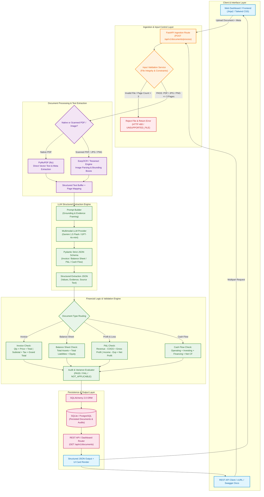

# Intelligent Document Extraction, Validation & API Platform

A production-ready, end-to-end AI platform that extracts structured data, validates financial calculations, stores results, and serves interactive dashboards from financial documents — Invoices, Balance Sheets, Profit & Loss Statements, and Cash Flow Statements.

---

## 🌟 Overview

The platform takes a raw document (PDF / JPG / PNG), runs it through validation, OCR, and LLM-driven structured extraction, then applies deterministic financial reconciliation checks before persisting the result and exposing it via a dashboard and REST API.

### Processing Pipeline

```
Document Upload
      ↓
Document Validation
(PDF / JPG / PNG / file integrity / page limit)
      ↓
Text Extraction / OCR
      ↓
AI-based Field & Table Extraction
      ↓
Structured JSON Output
      ↓
Financial Calculation Validation
      ↓
Confidence / Evidence
      ↓
Store Processing Result
      ↓
PASS / FAILED
      ↓
Dashboard + REST API Response
```

### Detailed Architecture



> This diagram renders natively on GitHub. A static export (`architecture.png` / `architecture.pdf`) also belongs in `docs/` per the project structure below.

---

## 🛠️ Technology Stack

| Layer | Choice | Why |
|---|---|---|
| Backend Framework | FastAPI (Python 3.11+) | Async request handling, built-in Pydantic validation, auto-generated OpenAPI/Swagger docs |
| LLM Extraction | Google Gemini 1.5 Flash / OpenAI GPT-4o-mini | Structured (JSON Schema) outputs, multimodal input, low latency & cost |
| OCR & Text Extraction | PyMuPDF (`fitz`) for native PDF text; EasyOCR / Tesseract fallback for scanned images | Fast vector extraction with a robust fallback for scanned/image documents |
| Database / Persistence | SQLAlchemy 2.0 ORM + SQLite (PostgreSQL-ready) | Zero-config local/free-tier persistence, swappable via `DATABASE_URL` |
| Frontend UI | Jinja2 Templates + HTML5 / TailwindCSS / Alpine.js | Single-service deployment, no separate build toolchain or CORS overhead |
| Testing | Pytest + HTTPX | Automated unit and integration testing |

---

## 📂 Project Structure

```
project-root/
├── backend/
│   ├── app/
│   │   ├── main.py
│   │   ├── api/
│   │   │   └── routes/
│   │   │       └── documents.py
│   │   ├── core/
│   │   │   ├── config.py
│   │   │   ├── database.py
│   │   │   └── logging.py
│   │   ├── models/
│   │   │   └── document.py
│   │   ├── schemas/
│   │   │   ├── document.py
│   │   │   └── extraction.py
│   │   ├── services/
│   │   │   ├── document_validation_service.py
│   │   │   ├── ocr_service.py
│   │   │   ├── extraction_service.py
│   │   │   ├── financial_validation_service.py
│   │   │   └── document_service.py
│   │   ├── repositories/
│   │   │   └── document_repository.py
│   │   └── utils/
│   ├── tests/
│   │   ├── test_api.py
│   │   ├── test_validation.py
│   │   └── test_extraction.py
│   ├── requirements.txt OR pyproject.toml
│
├── frontend/
│   ├── templates/
│   │   ├── dashboard.html
│   │   └── document_result.html
│   ├── static/
│   │   ├── css/
│   │   └── js/
│   └── <frontend application files>
│
├── docs/
│   ├── architecture.png OR architecture.pdf
│   └── solution_presentation.pdf
│
├── sample_outputs/
│   └── <JSON results>
│
├── .env.example
├── .gitignore
└── README.md
```

---

## 🚀 Deployed Application & Resources

| Resource | Link |
|---|---|
| Live Frontend Dashboard | [https://your-app-name.onrender.com/](https://your-app-name.onrender.com/) |
| Backend REST API | [https://your-app-name.onrender.com/api/v1](https://your-app-name.onrender.com/api/v1) |
| Swagger / OpenAPI Docs | [https://your-app-name.onrender.com/docs](https://your-app-name.onrender.com/docs) |
| Health Check Endpoint | [https://your-app-name.onrender.com/api/v1/health](https://your-app-name.onrender.com/api/v1/health) |
| GitHub Repository | [https://github.com/your-username/Intelligent-Document-Extraction-Validation-API-Platform](https://github.com/your-username/Intelligent-Document-Extraction-Validation-API-Platform) |

> Replace the placeholders above with your actual deployment and repository URLs once live.

---

## ⚙️ Environment Configuration

Copy `.env.example` to `.env` and populate your secrets:

```env
# Server Settings
ENVIRONMENT=production
DEBUG=false
PORT=8000

# Database
DATABASE_URL=sqlite:///./documents.db

# LLM & OCR API Keys
GEMINI_API_KEY=your_gemini_api_key_here
OPENAI_API_KEY=your_openai_api_key_here

# Processing Parameters
MAX_FILE_SIZE_MB=10
MAX_PAGE_COUNT=3
```

---

## 💻 Local Setup

**1. Clone the repository**

```bash
git clone https://github.com/your-username/Intelligent-Document-Extraction-Validation-API-Platform.git
cd Intelligent-Document-Extraction-Validation-API-Platform
```

**2. Set up a Python virtual environment**

```bash
python -m venv venv
source venv/bin/activate  # On Windows: venv\Scripts\activate
```

**3. Install dependencies**

```bash
pip install --upgrade pip
pip install -r backend/requirements.txt
```

**4. Initialize environment variables**

```bash
cp .env.example .env
# Add your API keys inside .env
```

**5. Run the application**

```bash
uvicorn backend.app.main:app --host 0.0.0.0 --port 8000 --reload
```

**6. Access local services**

- Dashboard: [http://localhost:8000](http://localhost:8000)
- API Docs: [http://localhost:8000/docs](http://localhost:8000/docs)

---

## 📡 API Usage & Endpoints

### 1. Process a document

`POST /api/v1/documents/process`

**Headers:** `Content-Type: multipart/form-data`

**Body:**
- `file`: file binary (`.pdf`, `.jpg`, `.png`)
- `document_type`: `invoice` | `balance_sheet` | `profit_and_loss` | `cash_flow_statement`

```bash
curl -X 'POST' \
  'https://your-app-name.onrender.com/api/v1/documents/process' \
  -F 'file=@sample_invoice.pdf' \
  -F 'document_type=invoice'
```

### 2. Get a document result by name

`GET /api/v1/documents/{document_name}`

```bash
curl -X 'GET' 'https://your-app-name.onrender.com/api/v1/documents/sample_invoice.pdf'
```

### 3. List all processed documents

`GET /api/v1/documents`

```bash
curl -X 'GET' 'https://your-app-name.onrender.com/api/v1/documents'
```

---

## 📐 Financial Validation Rules & Tolerance

Financial calculations use deterministic Python algorithms with a floating-point tolerance of **$0.05 (or 0.01%)** to absorb rounding variations across source documents. If a required input field is missing, the check resolves to `NOT_APPLICABLE` rather than assuming a value of zero.

**Invoice**
- Quantity × Unit Price ≈ Line Total
- Σ(Line Totals) ≈ Subtotal
- Subtotal + Tax Amount − Discount ≈ Total Amount

**Balance Sheet**
- Total Assets ≈ Total Liabilities + Total Equity *(evaluated per comparative period)*

**Profit & Loss Statement**
- Revenue − COGS ≈ Gross Profit
- Gross Profit − Operating Expenses ≈ Operating Profit
- Total Income − Total Expenditure ≈ Net Profit

**Cash Flow Statement**
- Operating CF + Investing CF + Financing CF + FX Adjustment ≈ Net Change in Cash
- Opening Cash + Net Change in Cash ≈ Closing Cash

Each rule resolves to an overall **PASS / FAILED** status that is surfaced in the stored result, the dashboard, and the REST API response.

---

## 🎯 Confidence & Evidence Grounding

- **Evidence grounding**: every extracted field returns an `evidence` object containing the raw `source_text` snippet and `page_number` where the value was located.
- **Confidence calculation**: combines native OCR layout certainty, LLM extraction log-probabilities (where exposed), and the outcome of the deterministic financial validation checks. Fields that fail post-extraction validation receive a reduced confidence score.

---

## 🗄️ Database & Persistence Model

Processed results persist via the SQLAlchemy ORM into an indexed database storing:
- Document metadata
- Operational/processing logs
- File validation metrics
- Raw OCR/text extractions
- Financial audit (PASS/FAILED) results
- Final structured JSON payloads

- **Database engine**: SQLite by default (single-file, lightweight); swap to PostgreSQL via `DATABASE_URL`.
- **Versioning**: re-uploading a document with an identical `document_name` updates the latest record while retaining historical processing timestamps.

---

## ⚠️ Known Limitations

- **Multi-page limits**: documents exceeding 3 pages are rejected by the input validation service.
- **Handwritten scans**: highly cursive or degraded handwritten documents may see reduced OCR accuracy.
- **Complex tables**: multi-nested tables spanning page boundaries require supplementary positional-context processing.

---

## 🚀 Production Optimization Roadmap

To take this from prototype to enterprise-grade:

- **Asynchronous architecture** — move from synchronous request handling to Celery / Redis / RabbitMQ task queues for heavy multi-page OCR jobs.
- **Object storage** — migrate local file storage to AWS S3, Google Cloud Storage, or Azure Blob Storage.
- **Advanced layout parsing** — upgrade OCR to multimodal vision models or dedicated layout models (e.g., LayoutLMv3, Azure AI Document Intelligence).
- **Enhanced security** — add OAuth2 / JWT authentication, role-based access control (RBAC), rate-limiting middleware, and encryption at rest.

---

## 🧪 Testing

```bash
pytest backend/tests/
```

Covers API endpoint behavior (`test_api.py`), financial validation logic (`test_validation.py`), and extraction correctness (`test_extraction.py`).

---

## 🤖 AI Assistance Declaration

AI coding tools (ChatGPT, Claude, Cursor) were used during development for:
- Initial Pydantic schema generation for complex financial statements
- Drafting FastAPI endpoint boilerplate and HTML/Tailwind dashboard templates
- Writing unit test stubs for financial validation logic

---

## 📄 License

Add your chosen license here (e.g., MIT, Apache 2.0).
